---
### **Проект по автоматизации тестовых сценариев для сайта www.bcc.kz**

<p align="center">
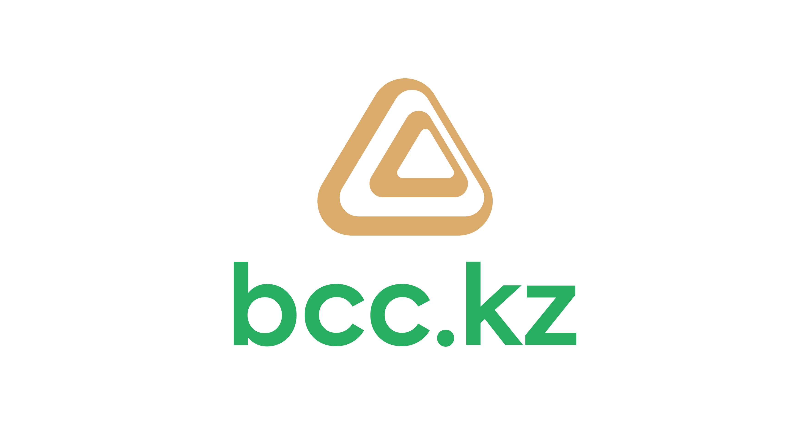
</p>
<p>Банк ЦентрКредит - один из лидеров банковской системы страны, который &nbsp;35 лет предоставляет простые и удобные продукты и сервисы самых современных технологий во всех регионах Казахстана.<br><br>Сегодня Банк имеет собственную широкую филиальную сеть по республике, обслуживает физических и юридических лиц в 19 филиалах и более 160 отделениях по Казахстану. Клиентами Банка являются более 3 млн. физических и более 140 тыс. юридических лиц.</p>

---
## :notebook: Содержание:

- [Стек технологий](#computer-стек-технологий)
- [Тестовые сценарии](#clipboard-тестовые-сценарии)
- [Сборка в Jenkins](#-сборка-в-jenkins)
- [Команда для запуска](#rocket-команда-для-запуска)
- [Allure отчет](#-allure-отчет)
- [Интеграция с Allure TestOps](#-интеграция-с-allure-testops)
- [Интеграция с Jira](#-интеграция-с-jira)
- [Уведомления в Telegram чат с ботом](#-уведомления-в-telegram-чат-с-ботом)
- [Видео запуска тестов в Selenoid](#-видео-запуска-тестов-в-selenoid)

---
## :computer: Стек технологий

<p align="left">
<a href="https://www.jetbrains.com/idea/"></a>
<a href="https://www.java.com/"></a>
<a href="https://github.com/"></a>
<a href="https://junit.org/junit5/"></a>
<a href="https://gradle.org/"></a>
<a href="https://selenide.org/"></a>
<a href="https://aerokube.com/selenoid/"></a>
<a href="https://github.com/allure-framework/allure2"></a>
<a href="https://qameta.io/"></a>
<a href="https://www.jenkins.io/"></a>
<a href="https://www.atlassian.com/ru/software/jira"></a>
<a href="https://www.telegram.org/"></a>
</p>

---
## :clipboard: Тестовые сценарии

1. [Главная страница](https://github.com/StasK86/BCC_Tests/blob/master/src/test/java/com/krigersv/tests/HomeBccTest.java)
   - :heavy_check_mark:_Проверка элементов на главной странице_
2. [Раздел "Отделения и банкоматы"](https://github.com/StasK86/BCC_Tests/blob/master/src/test/java/com/krigersv/tests/BankBranchBccTest.java)
   - :heavy_check_mark:_Проверка подсказок в поисковой строке_
3. [Раздел "Кредиты наличными"](https://github.com/StasK86/BCC_Tests/blob/master/src/test/java/com/krigersv/tests/ApplicationBccTests.java)
   - :heavy_check_mark:_Проверка заполнения поля 'Оставьте заявку на кредит' при выборе значения из списка_
   - :heavy_check_mark:_Проверка элементов наличия преимуществ_
4. [Раздел "Онлайн ипотека на вторичное жильё"](https://github.com/StasK86/BCC_Tests/blob/master/src/test/java/com/krigersv/tests/MortgageBccTest.java)
   - :heavy_check_mark:_Проверка изменения расчёта калькулятора при нажатии на чекбокс_
5. [Раздел "Депозиты"](https://github.com/StasK86/BCC_Tests/blob/master/src/test/java/com/krigersv/tests/DepositBccTest.java)
   - :heavy_check_mark:_Проверка заполнения заявки на Депозит “Чемпион”_


---
###  Сборка в [Jenkins](https://jenkins.autotests.cloud/job/BCC_Tests_jenkins/)
<p align="center">
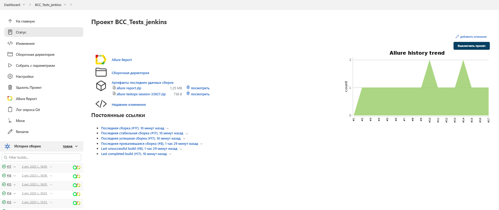
</p>

____
### Параметры сборки проекта

| Параметр        | Назначение                           |
|-----------------|--------------------------------------|
| BROWSER         | Браузер для запуска                  |
| BROWSER_VERSION | Версия браузера                      |
| BROWSER_SIZE    | Разрешение экрана                    |
| TASK            | Выбор конкретных тестов для запуска  |
| ENVIRONMENT     | Рабочее окружение                    |
| COMMENT         | Комментарий                          |

### Запуск параметризованных автотестов в **Jenkins**

<p align="center">
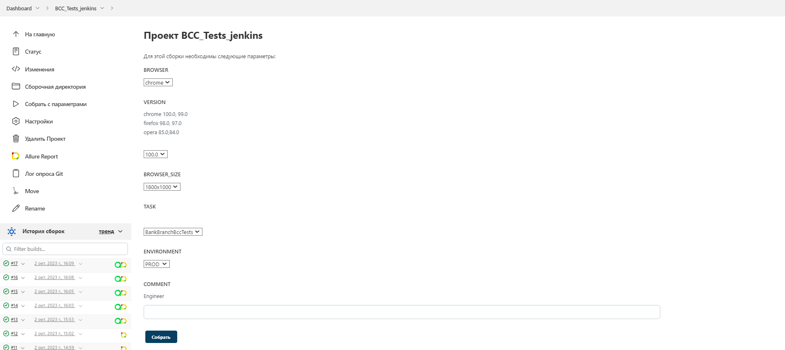
</p>

## :rocket: Команда для запуска

```bash
clean
${TASK}
-Dbrowser=${BROWSER}
-DbrowserSize=${BROWSER_SIZE}
-DbrowserVersion=${BROWSER_VERSION}
-DselenoidUrl=${SELENOID_LINK}
```

---
##  [Allure](http://192.168.31.186:59047/index.html#) отчет

### Главная страница отчета

<p align="center">
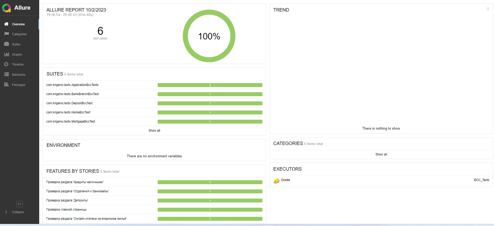
</p>

### Тест-кейсы

<p align="center">
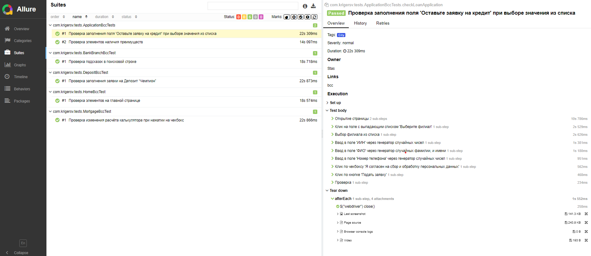
</p>

### Содержание тест-кейсов

- :heavy_check_mark: Подробное описание шагов
- :heavy_check_mark: Тег
- :heavy_check_mark: Критичность теста
- :heavy_check_mark: Автор
- :heavy_check_mark: Ссылка на раздел сайта (для каждый тестов свой раздел)
- :heavy_check_mark: Последний скриншот для каждого теста
- :heavy_check_mark: HTML разметка страницы
- :heavy_check_mark: Логи браузера
- :heavy_check_mark: Видео с прохождением теста

### Графики

<p align="center">
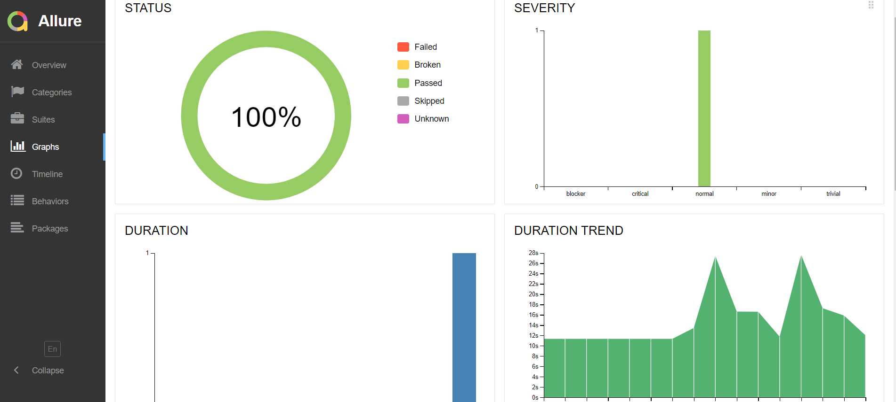
</p>

---
##  Интеграция с [Allure TestOps](https://allure.autotests.cloud/project/3696/dashboards)

### Dashboards
<p align="center">
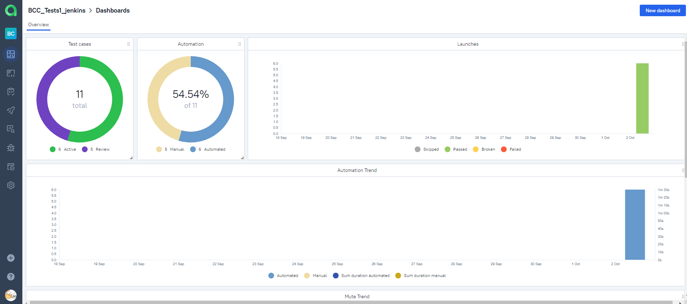
</p>

### Ручные и автоматизированные тест-кейсы
<p align="center">
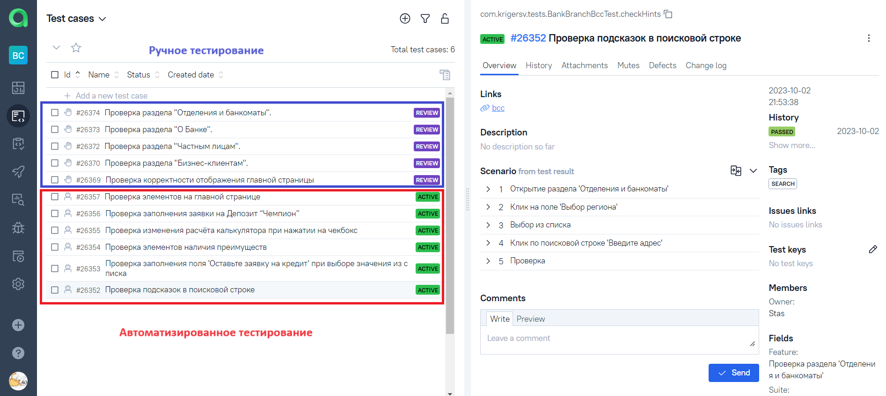
</p>

### Запуск автоматизированных тестов в **TestOps**
<p align="center">
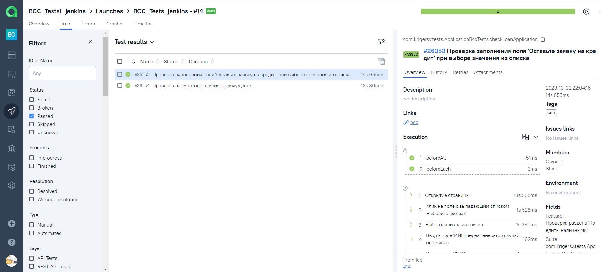
</p>

---
##  Интеграция с [Jira](https://jira.autotests.cloud/browse/HOMEWORK-903)

### Задача в Jira

<p align="center">
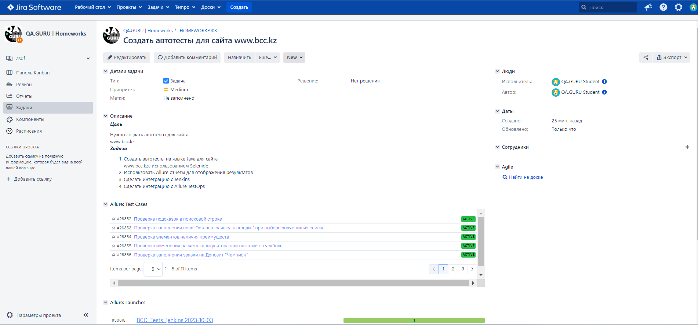
</p>

#### Содержание задачи

- :heavy_check_mark: Цель
- :heavy_check_mark: Задачи для выполнения
- :heavy_check_mark: Тест-кейсы из Allure TestOps
- :heavy_check_mark: Результат прогона тестов в Allure TestOps

---

##  Уведомления в Telegram чат с ботом

### Уведомление из переписки с чат ботом

<p align="center">
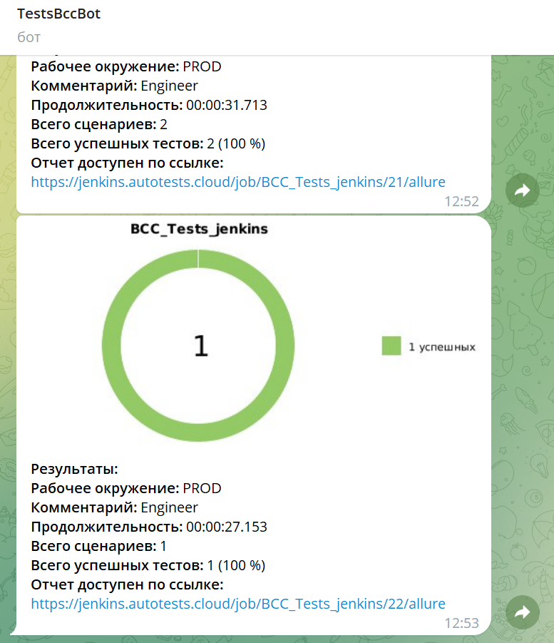
</p>


#### Содержание уведомления в Telegram

- :heavy_check_mark: Окружение
- :heavy_check_mark: Комментарий
- :heavy_check_mark: Длительность прохождения тестов
- :heavy_check_mark: Общее количество сценариев
- :heavy_check_mark: Процент прохождения тестов
- :heavy_check_mark: Ссылка на Allure отчет

---

##  Видео запуска тестов в Selenoid

<p align="center">
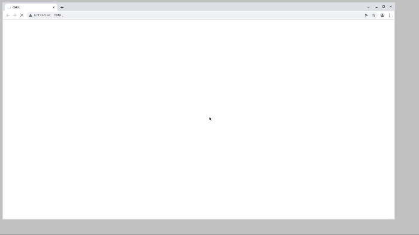
</p>

---


